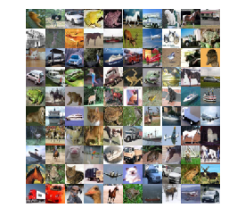

```python
import tensorflow as tf
```


```python
# Helper functions

def weight_variable(shape):
    initial = tf.truncated_normal(shape, stddev=0.1)
    #initial = tf.contrib.layers.variance_scaling_initializer()
    return tf.Variable(initial)


def bias_variable(shape):
    initial = tf.constant(0.1, shape=shape)
    return tf.Variable(initial)


def conv2d(x, W):
    return tf.nn.conv2d(x, W, strides=[1, 1, 1, 1], padding='SAME')


def max_pool_2x2(x):
    return tf.nn.max_pool(x, ksize=[1, 2, 2, 1],
                          strides=[1, 2, 2, 1], padding='SAME')


def conv_layer(input, shape):
    W = weight_variable(shape)
    b = bias_variable([shape[3]])
    return tf.nn.relu(conv2d(input, W) + b)

def conv_norm_layer(input, shape, phase):
    W = weight_variable(shape)
    b = bias_variable([shape[3]])
    return tf.nn.relu( batch_norm_wrapper( conv2d(input, W) + b, phase))

def full_layer(input, size):
    in_size = int(input.get_shape()[1])
    W = weight_variable([in_size, size])
    b = bias_variable([size])
    return tf.matmul(input, W) + b

def batch_norm_wrapper(inputs, is_training, decay = 0.999):
    scale = tf.Variable(tf.ones([inputs.get_shape()[-1]]))
    beta = tf.Variable(tf.zeros([inputs.get_shape()[-1]]))
    pop_mean = tf.Variable(tf.zeros([inputs.get_shape()[-1]]), trainable=False)
    pop_var = tf.Variable(tf.ones([inputs.get_shape()[-1]]), trainable=False)

    if is_training == True:
        batch_mean, batch_var = tf.nn.moments(inputs,[0])
        train_mean = tf.assign(pop_mean, pop_mean * decay + batch_mean * (1 - decay))
        train_var = tf.assign(pop_var, pop_var * decay + batch_var * (1 - decay))
        with tf.control_dependencies([train_mean, train_var]):
            return tf.nn.batch_normalization(inputs,
                batch_mean, batch_var, beta, scale, epsilon)
    else:
        return tf.nn.batch_normalization(inputs, pop_mean, pop_var, beta, scale, epsilon)
```


```python
import pickle
import os
import numpy as np
import matplotlib.pyplot as plt
import tensorflow as tf

DATA_PATH = "./cifar-10-batches-py"
BATCH_SIZE = 50
STEPS = 500000
epsilon = 1e-3

def one_hot(vec, vals=10):
    n = len(vec)
    out = np.zeros((n, vals))
    out[range(n), vec] = 1
    return out


def unpickle(file):
    with open(os.path.join(DATA_PATH, file), 'rb') as fo:
        u = pickle._Unpickler(fo)
        u.encoding = 'latin1'
        dict = u.load()
    return dict


def display_cifar(images, size):
    n = len(images)
    plt.figure()
    plt.gca().set_axis_off()
    im = np.vstack([np.hstack([images[np.random.choice(n)] for i in range(size)])
                    for i in range(size)])
    plt.imshow(im)
    plt.show()


class CifarLoader(object):
    """
    Load and mange the CIFAR dataset.
    (for any practical use there is no reason not to use the built-in dataset handler instead)
    """
    def __init__(self, source_files):
        self._source = source_files
        self._i = 0
        self.images = None
        self.labels = None

    def load(self):
        data = [unpickle(f) for f in self._source]
        images = np.vstack([d["data"] for d in data])
        n = len(images)
        self.images = images.reshape(n, 3, 32, 32).transpose(0, 2, 3, 1).astype(float) / 255
        self.labels = one_hot(np.hstack([d["labels"] for d in data]), 10)
        return self

    def next_batch(self, batch_size):
        x, y = self.images[self._i:self._i+batch_size], self.labels[self._i:self._i+batch_size]
        self._i = (self._i + batch_size) % len(self.images)
        return x, y

    def random_batch(self, batch_size):
        n = len(self.images)
        ix = np.random.choice(n, batch_size)
        return self.images[ix], self.labels[ix]

class CifarDataManager(object):
    def __init__(self):
        self.train = CifarLoader(["data_batch_{}".format(i) for i in range(1, 6)]).load()
        self.test = CifarLoader(["test_batch"]).load()


def run_simple_net():
    cifar = CifarDataManager()
    x = tf.placeholder(tf.float32, shape=[None, 32, 32, 3])
    y_ = tf.placeholder(tf.float32, shape=[None, 10])
    keep_prob = tf.placeholder(tf.float32)
    phase = tf.placeholder(tf.bool) 

    conv1 = conv_norm_layer(x, [5, 5, 3, 32], phase)
    conv1_pool = max_pool_2x2(conv1)

    conv2 = conv_norm_layer(conv1_pool, [5, 5, 32, 64], phase)
    conv2_pool = max_pool_2x2(conv2)

    conv3 = conv_norm_layer(conv2_pool, [5, 5, 64, 128], phase)
    conv3_pool = max_pool_2x2(conv3)
    conv3_flat = tf.reshape(conv3_pool, [-1, 4 * 4 * 128])
    conv3_drop = tf.nn.dropout(conv3_flat, keep_prob=keep_prob)

    full_1 = tf.nn.relu(full_layer(conv3_drop, 512))
    full1_drop = tf.nn.dropout(full_1, keep_prob=keep_prob)

    y_conv = full_layer(full1_drop, 10)

    cross_entropy = tf.reduce_mean(tf.nn.softmax_cross_entropy_with_logits(logits=y_conv, labels=y_))
    train_step = tf.train.AdamOptimizer(1e-3).minimize(cross_entropy)

    correct_prediction = tf.equal(tf.argmax(y_conv, 1), tf.argmax(y_, 1))
    accuracy = tf.reduce_mean(tf.cast(correct_prediction, tf.float32))

    def test(sess):
        X = cifar.test.images.reshape(10, 1000, 32, 32, 3)
        Y = cifar.test.labels.reshape(10, 1000, 10)
        acc = np.mean([sess.run(accuracy, feed_dict={x: X[i], y_: Y[i], phase: False, keep_prob: 1.0})
                       for i in range(10)])
        print("Accuracy: {:.4}%".format(acc * 100))

    with tf.Session() as sess:
        sess.run(tf.global_variables_initializer())

        for i in range(STEPS):
            batch = cifar.train.next_batch(BATCH_SIZE)
            sess.run(train_step, feed_dict={x: batch[0], y_: batch[1], phase: True,  keep_prob: 0.5})

            if i % 500 == 0:
                test(sess)

        test(sess)


def build_second_net():
    cifar = CifarDataManager()
    x = tf.placeholder(tf.float32, shape=[None, 32, 32, 3])
    y_ = tf.placeholder(tf.float32, shape=[None, 10])
    keep_prob = tf.placeholder(tf.float32)
    phase = tf.placeholder(tf.bool) 

    C1, C2, C3 = 32, 64, 128
    F1 = 600

    #x = batch_norm(x, phase)
    conv1_1 = conv_norm_layer(x, [3, 3, 3, C1], phase)
    conv1_2 = conv_norm_layer(conv1_1, [3, 3, C1, C1], phase)
    conv1_3 = conv_norm_layer(conv1_2, [3, 3, C1, C1], phase)
    conv1_pool = max_pool_2x2(conv1_3)
    conv1_drop = tf.nn.dropout(conv1_pool, keep_prob=keep_prob)

    conv2_1 = conv_norm_layer(conv1_drop, [3, 3, C1, C2], phase)
    conv2_2 = conv_norm_layer(conv2_1, [3, 3, C2, C2], phase)
    conv2_3 = conv_norm_layer(conv2_2, [3, 3, C2, C2], phase)
    conv2_pool = max_pool_2x2(conv2_3)
    conv2_drop = tf.nn.dropout(conv2_pool, keep_prob=keep_prob)

    conv3_1 = conv_norm_layer(conv2_drop, [3, 3, C2, C3], phase)
    conv3_2 = conv_norm_layer(conv3_1, [3, 3, C3, C3], phase)
    conv3_3 = conv_norm_layer(conv3_2, [3, 3, C3, C3], phase)
    conv3_pool = tf.nn.max_pool(conv3_3, ksize=[1, 8, 8, 1], strides=[1, 8, 8, 1], padding='SAME')
    conv3_flat = tf.reshape(conv3_pool, [-1, C3])
    conv3_drop = tf.nn.dropout(conv3_flat, keep_prob=keep_prob)

    full1 = tf.nn.relu(full_layer(conv3_flat, F1))
    full1_drop = tf.nn.dropout(full1, keep_prob=keep_prob)

    y_conv = full_layer(full1_drop, 10)

    cross_entropy = tf.reduce_mean(tf.nn.softmax_cross_entropy_with_logits(logits=y_conv, labels=y_))
    train_step = tf.train.AdamOptimizer(5e-4).minimize(cross_entropy)

    correct_prediction = tf.equal(tf.argmax(y_conv, 1), tf.argmax(y_, 1))
    accuracy = tf.reduce_mean(tf.cast(correct_prediction, tf.float32))

    def test(sess):
        X = cifar.test.images.reshape(10, 1000, 32, 32, 3)
        Y = cifar.test.labels.reshape(10, 1000, 10)
        acc = np.mean([sess.run(accuracy, feed_dict={x: X[i], y_: Y[i], phase: False , keep_prob: 1.0})
                       for i in range(10)])
        print("Accuracy: {:.4}%".format(acc * 100))

    with tf.Session() as sess:
        sess.run(tf.global_variables_initializer())

        for i in range(STEPS):
            batch = cifar.train.next_batch(BATCH_SIZE)
            sess.run(train_step, feed_dict={x: batch[0], y_: batch[1], phase: True, keep_prob: 0.5})

            if i % 500 == 0:
                test(sess)

        test(sess)


def create_cifar_image():
    d = CifarDataManager()
    print("Number of train images: {}".format(len(d.train.images)))
    print("Number of train labels: {}".format(len(d.train.labels)))
    print("Number of test images: {}".format(len(d.test.images)))
    print("Number of test images: {}".format(len(d.test.labels)))
    images = d.train.images
    display_cifar(images, 10)
```


```python
create_cifar_image()
```

    Number of train images: 50000
    Number of train labels: 50000
    Number of test images: 10000
    Number of test images: 10000





```python
run_simple_net()
```

    Accuracy: 11.14%
    Accuracy: 43.33%
    Accuracy: 47.72%
    Accuracy: 49.42%
    Accuracy: 55.05%
    Accuracy: 58.3%
    Accuracy: 61.28%
    Accuracy: 57.95%
    Accuracy: 65.16%
    Accuracy: 63.02%
    Accuracy: 67.24%
    Accuracy: 63.56%
    Accuracy: 67.67%
    Accuracy: 65.49%
    Accuracy: 69.49%
    Accuracy: 69.16%
    Accuracy: 69.66%
    Accuracy: 70.72%
    Accuracy: 71.93%
    Accuracy: 69.34%
    Accuracy: 70.39%
    Accuracy: 71.15%
    Accuracy: 72.94%
    Accuracy: 71.53%
    Accuracy: 73.49%
    Accuracy: 71.79%
    Accuracy: 71.93%
    Accuracy: 71.12%
    Accuracy: 73.47%
    Accuracy: 72.49%
    Accuracy: 74.03%
    Accuracy: 70.01%
    Accuracy: 74.21%
    Accuracy: 72.42%
    Accuracy: 73.63%
    Accuracy: 72.65%
    Accuracy: 74.18%
    Accuracy: 73.05%
    Accuracy: 74.97%
    Accuracy: 74.02%
    Accuracy: 73.46%
    Accuracy: 73.5%
    Accuracy: 74.29%
    Accuracy: 73.23%
    Accuracy: 75.01%
    Accuracy: 73.64%
    Accuracy: 74.37%
    Accuracy: 75.41%
    Accuracy: 75.28%
    Accuracy: 75.45%
    Accuracy: 75.35%
    Accuracy: 75.24%
    Accuracy: 75.59%
    Accuracy: 75.92%
    Accuracy: 75.43%
    Accuracy: 75.02%
    Accuracy: 75.24%
    Accuracy: 75.87%
    Accuracy: 75.38%
    Accuracy: 76.03%
    Accuracy: 75.42%
    Accuracy: 75.64%
    Accuracy: 75.83%
    Accuracy: 75.49%
    Accuracy: 75.36%
    Accuracy: 75.14%
    Accuracy: 75.94%
    Accuracy: 75.73%
    Accuracy: 76.33%
    Accuracy: 75.53%
    Accuracy: 75.77%
    Accuracy: 75.8%
    Accuracy: 75.4%
    Accuracy: 76.26%
    Accuracy: 75.9%
    Accuracy: 73.55%
    Accuracy: 75.29%
    Accuracy: 76.37%
    Accuracy: 76.49%
    Accuracy: 75.92%
    Accuracy: 75.24%
    Accuracy: 76.35%
    Accuracy: 75.96%
    Accuracy: 76.49%
    Accuracy: 76.67%
    Accuracy: 76.46%
    Accuracy: 75.63%
    Accuracy: 76.93%
    Accuracy: 75.73%
    Accuracy: 76.22%
    Accuracy: 74.97%
    Accuracy: 75.99%
    Accuracy: 76.77%
    Accuracy: 76.16%
    Accuracy: 75.58%
    Accuracy: 77.01%
    Accuracy: 76.35%
    Accuracy: 76.84%
    Accuracy: 76.02%
    Accuracy: 76.27%
    Accuracy: 76.15%
    Accuracy: 77.02%
    Accuracy: 75.18%
    Accuracy: 76.91%
    Accuracy: 76.39%
    Accuracy: 76.95%
    Accuracy: 75.67%
    Accuracy: 76.51%
    Accuracy: 76.46%
    Accuracy: 76.47%
    Accuracy: 76.34%
    Accuracy: 76.74%
    Accuracy: 76.62%
    Accuracy: 76.04%
    Accuracy: 76.66%
    Accuracy: 76.6%
    Accuracy: 76.47%
    Accuracy: 76.9%
    Accuracy: 76.29%
    Accuracy: 76.89%
    Accuracy: 76.45%
    Accuracy: 77.04%
    Accuracy: 77.04%
    Accuracy: 77.44%
    Accuracy: 75.54%
    Accuracy: 77.28%
    Accuracy: 76.51%
    Accuracy: 77.3%
    Accuracy: 76.69%
    Accuracy: 77.1%
    Accuracy: 76.69%
    Accuracy: 77.18%
    Accuracy: 76.99%
    Accuracy: 77.11%
    Accuracy: 76.37%
    Accuracy: 77.45%
    Accuracy: 76.04%
    Accuracy: 77.34%
    Accuracy: 76.5%
    Accuracy: 76.94%
    Accuracy: 76.32%
    Accuracy: 77.07%
    Accuracy: 76.9%
    Accuracy: 77.57%
    Accuracy: 77.33%
    Accuracy: 77.48%
    Accuracy: 77.0%
    Accuracy: 77.14%
    Accuracy: 77.25%
    Accuracy: 77.75%
    Accuracy: 76.36%
    Accuracy: 77.1%
    Accuracy: 76.81%
    Accuracy: 76.96%
    Accuracy: 76.85%
    Accuracy: 77.19%
    Accuracy: 77.33%
    Accuracy: 76.7%
    Accuracy: 76.71%
    Accuracy: 77.5%
    Accuracy: 77.19%
    Accuracy: 77.37%
    Accuracy: 76.71%
    Accuracy: 77.27%
    Accuracy: 76.44%
    Accuracy: 77.3%
    Accuracy: 76.75%
    Accuracy: 76.26%
    Accuracy: 76.87%
    Accuracy: 77.38%
    Accuracy: 77.18%
    Accuracy: 77.28%
    Accuracy: 76.74%
    Accuracy: 77.01%
    Accuracy: 76.84%
    Accuracy: 76.87%
    Accuracy: 77.38%
    Accuracy: 77.01%
    Accuracy: 77.42%
    Accuracy: 77.11%
    Accuracy: 76.76%
    Accuracy: 77.19%
    Accuracy: 76.77%
    Accuracy: 77.01%
    Accuracy: 76.07%
    Accuracy: 76.98%
    Accuracy: 77.22%
    Accuracy: 77.37%
    Accuracy: 76.72%
    Accuracy: 77.0%
    Accuracy: 77.46%
    Accuracy: 77.38%
    Accuracy: 76.91%
    Accuracy: 77.34%
    Accuracy: 77.33%
    Accuracy: 76.82%
    Accuracy: 76.82%
    Accuracy: 77.2%
    Accuracy: 76.29%
    Accuracy: 77.04%
    Accuracy: 76.87%
    Accuracy: 77.89%
    Accuracy: 76.4%
    Accuracy: 77.35%
    Accuracy: 75.91%
    Accuracy: 77.28%
    Accuracy: 76.6%
    Accuracy: 77.57%
    Accuracy: 77.42%
    Accuracy: 77.21%
    Accuracy: 77.37%
    Accuracy: 76.98%
    Accuracy: 77.08%
    Accuracy: 77.56%
    Accuracy: 77.3%
    Accuracy: 77.62%
    Accuracy: 77.05%
    Accuracy: 77.71%
    Accuracy: 77.2%
    Accuracy: 77.39%
    Accuracy: 77.51%
    Accuracy: 76.78%
    Accuracy: 77.15%
    Accuracy: 77.02%
    Accuracy: 77.48%
    Accuracy: 77.4%
    Accuracy: 76.12%
    Accuracy: 77.32%
    Accuracy: 75.95%
    Accuracy: 76.92%
    Accuracy: 76.84%
    Accuracy: 76.95%
    Accuracy: 76.45%
    Accuracy: 76.9%
    Accuracy: 77.29%
    Accuracy: 77.23%
    Accuracy: 76.67%
    Accuracy: 77.18%
    Accuracy: 76.35%
    Accuracy: 77.66%
    Accuracy: 77.03%
    Accuracy: 77.06%
    Accuracy: 77.15%
    Accuracy: 77.92%
    Accuracy: 76.58%
    Accuracy: 77.41%
    Accuracy: 77.02%
    Accuracy: 77.51%
    Accuracy: 76.09%
    Accuracy: 77.84%
    Accuracy: 76.7%
    Accuracy: 77.56%
    Accuracy: 77.17%
    Accuracy: 77.19%
    Accuracy: 77.46%
    Accuracy: 77.01%
    Accuracy: 77.58%
    Accuracy: 77.48%
    Accuracy: 77.78%
    Accuracy: 77.03%
    Accuracy: 76.44%
    Accuracy: 77.08%
    Accuracy: 77.07%
    Accuracy: 77.61%
    Accuracy: 77.09%
    Accuracy: 77.76%
    Accuracy: 76.98%
    Accuracy: 77.39%
    Accuracy: 76.83%
    Accuracy: 77.11%
    Accuracy: 76.37%
    Accuracy: 76.82%
    Accuracy: 77.36%
    Accuracy: 77.73%
    Accuracy: 76.12%
    Accuracy: 77.52%
    Accuracy: 76.76%
    Accuracy: 77.23%
    Accuracy: 77.2%
    Accuracy: 77.39%
    Accuracy: 76.92%
    Accuracy: 77.51%
    Accuracy: 77.15%
    Accuracy: 77.75%
    Accuracy: 77.15%
    Accuracy: 77.25%
    Accuracy: 77.18%
    Accuracy: 77.07%
    Accuracy: 77.16%
    Accuracy: 76.77%
    Accuracy: 76.06%
    Accuracy: 77.52%
    Accuracy: 77.36%
    Accuracy: 77.24%
    Accuracy: 77.42%
    Accuracy: 77.7%
    Accuracy: 76.77%
    Accuracy: 77.25%
    Accuracy: 76.95%
    Accuracy: 76.48%
    Accuracy: 76.45%
    Accuracy: 77.2%
    Accuracy: 76.58%
    Accuracy: 77.43%
    Accuracy: 75.77%
    Accuracy: 76.97%
    Accuracy: 77.11%
    Accuracy: 78.03%
    Accuracy: 76.67%
    Accuracy: 76.86%
    Accuracy: 76.88%
    Accuracy: 77.09%
    Accuracy: 77.69%
    Accuracy: 77.47%
    Accuracy: 77.01%
    Accuracy: 77.6%
    Accuracy: 77.46%
    Accuracy: 77.03%
    Accuracy: 77.32%
    Accuracy: 77.34%
    Accuracy: 77.13%
    Accuracy: 77.71%
    Accuracy: 77.46%
    Accuracy: 77.29%
    Accuracy: 76.58%
    Accuracy: 78.04%
    Accuracy: 77.09%
    Accuracy: 77.65%
    Accuracy: 77.26%
    Accuracy: 77.55%
    Accuracy: 77.89%
    Accuracy: 77.48%
    Accuracy: 76.85%
    Accuracy: 76.91%
    Accuracy: 77.39%
    Accuracy: 77.59%
    Accuracy: 77.11%
    Accuracy: 77.29%
    Accuracy: 77.9%
    Accuracy: 77.54%
    Accuracy: 76.59%
    Accuracy: 77.66%
    Accuracy: 77.07%
    Accuracy: 77.03%
    Accuracy: 76.92%
    Accuracy: 77.39%
    Accuracy: 77.16%
    Accuracy: 77.39%
    Accuracy: 76.8%
    Accuracy: 77.3%
    Accuracy: 77.65%
    Accuracy: 77.41%
    Accuracy: 77.11%
    Accuracy: 78.0%
    Accuracy: 77.34%
    Accuracy: 77.9%
    Accuracy: 76.84%
    Accuracy: 77.41%
    Accuracy: 77.19%
    Accuracy: 77.61%
    Accuracy: 77.16%
    Accuracy: 77.89%
    Accuracy: 77.14%
    Accuracy: 77.59%
    Accuracy: 76.52%
    Accuracy: 77.85%
    Accuracy: 77.05%
    Accuracy: 77.56%
    Accuracy: 77.59%
    Accuracy: 76.75%
    Accuracy: 77.67%
    Accuracy: 77.74%
    Accuracy: 76.49%
    Accuracy: 77.43%
    Accuracy: 77.49%
    Accuracy: 76.95%
    Accuracy: 77.5%
    Accuracy: 77.31%
    Accuracy: 77.06%
    Accuracy: 77.73%
    Accuracy: 77.42%
    Accuracy: 77.35%
    Accuracy: 77.2%
    Accuracy: 77.65%
    Accuracy: 77.14%
    Accuracy: 77.02%
    Accuracy: 77.09%
    Accuracy: 77.31%
    Accuracy: 77.54%
    Accuracy: 77.37%
    Accuracy: 77.19%
    Accuracy: 77.58%
    Accuracy: 77.18%
    Accuracy: 78.04%
    Accuracy: 77.18%
    Accuracy: 78.09%
    Accuracy: 76.67%
    Accuracy: 78.05%
    Accuracy: 77.47%
    Accuracy: 77.51%
    Accuracy: 77.78%
    Accuracy: 76.92%
    Accuracy: 77.21%
    Accuracy: 77.65%
    Accuracy: 77.1%
    Accuracy: 78.08%
    Accuracy: 77.36%
    Accuracy: 77.07%
    Accuracy: 77.34%
    Accuracy: 77.86%
    Accuracy: 76.9%
    Accuracy: 77.7%
    Accuracy: 77.91%
    Accuracy: 77.1%
    Accuracy: 77.32%
    Accuracy: 77.53%
    Accuracy: 77.59%
    Accuracy: 77.22%
    Accuracy: 77.32%
    Accuracy: 77.48%
    Accuracy: 77.35%
    Accuracy: 77.29%
    Accuracy: 77.45%
    Accuracy: 77.5%
    Accuracy: 76.78%
    Accuracy: 77.8%
    Accuracy: 77.14%
    Accuracy: 77.39%
    Accuracy: 76.39%
    Accuracy: 77.81%
    Accuracy: 76.83%
    Accuracy: 77.12%
    Accuracy: 76.96%
    Accuracy: 77.72%
    Accuracy: 77.18%
    Accuracy: 77.66%
    Accuracy: 77.59%
    Accuracy: 77.98%
    Accuracy: 76.89%
    Accuracy: 77.33%
    Accuracy: 76.9%
    Accuracy: 77.57%
    Accuracy: 77.87%
    Accuracy: 77.16%
    Accuracy: 77.58%
    Accuracy: 78.44%
    Accuracy: 77.33%
    Accuracy: 77.4%
    Accuracy: 77.49%
    Accuracy: 77.69%
    Accuracy: 76.34%
    Accuracy: 77.7%
    Accuracy: 77.42%
    Accuracy: 77.62%
    Accuracy: 77.3%
    Accuracy: 77.13%
    Accuracy: 77.11%
    Accuracy: 77.97%
    Accuracy: 77.76%
    Accuracy: 78.15%
    Accuracy: 77.69%
    Accuracy: 78.06%
    Accuracy: 77.78%
    Accuracy: 77.52%
    Accuracy: 77.64%
    Accuracy: 77.16%
    Accuracy: 77.25%
    Accuracy: 77.95%
    Accuracy: 76.6%
    Accuracy: 77.89%
    Accuracy: 77.38%
    Accuracy: 77.46%
    Accuracy: 77.68%
    Accuracy: 76.93%
    Accuracy: 77.07%
    Accuracy: 77.93%
    Accuracy: 78.11%
    Accuracy: 77.95%
    Accuracy: 78.18%
    Accuracy: 77.4%
    Accuracy: 76.7%
    Accuracy: 77.65%
    Accuracy: 77.51%
    Accuracy: 77.04%
    Accuracy: 77.11%
    Accuracy: 77.69%
    Accuracy: 77.25%
    Accuracy: 77.3%
    Accuracy: 77.31%
    Accuracy: 77.53%
    Accuracy: 77.56%
    Accuracy: 77.13%
    Accuracy: 77.47%
    Accuracy: 77.63%
    Accuracy: 76.85%
    Accuracy: 77.42%
    Accuracy: 77.49%
    Accuracy: 76.93%
    Accuracy: 76.89%
    Accuracy: 77.7%
    Accuracy: 77.32%
    Accuracy: 77.73%
    Accuracy: 77.42%
    Accuracy: 77.5%
    Accuracy: 76.96%
    Accuracy: 77.39%
    Accuracy: 77.46%
    Accuracy: 77.9%
    Accuracy: 76.7%
    Accuracy: 77.43%
    Accuracy: 77.5%
    Accuracy: 77.71%
    Accuracy: 77.63%
    Accuracy: 77.65%
    Accuracy: 78.0%
    Accuracy: 77.16%
    Accuracy: 76.95%
    Accuracy: 77.47%
    Accuracy: 77.5%
    Accuracy: 77.64%
    Accuracy: 77.96%
    Accuracy: 77.29%
    Accuracy: 77.24%
    Accuracy: 77.24%
    Accuracy: 77.33%
    Accuracy: 77.23%
    Accuracy: 77.2%
    Accuracy: 77.46%
    Accuracy: 76.82%
    Accuracy: 77.33%


```python
build_second_net()
```

    Accuracy: 9.83%
    Accuracy: 22.95%
    Accuracy: 34.09%
    Accuracy: 39.83%
    Accuracy: 41.13%
    Accuracy: 42.55%
    Accuracy: 46.56%
    Accuracy: 49.04%
    Accuracy: 48.6%
    Accuracy: 52.86%
    Accuracy: 55.87%
    Accuracy: 58.08%
    Accuracy: 58.15%
    Accuracy: 59.76%
    Accuracy: 60.05%
    Accuracy: 61.11%
    Accuracy: 62.18%
    Accuracy: 63.66%
    Accuracy: 62.13%
    Accuracy: 64.32%
    Accuracy: 63.8%
    Accuracy: 66.46%
    Accuracy: 67.04%
    Accuracy: 67.12%
    Accuracy: 66.66%
    Accuracy: 67.77%
    Accuracy: 67.52%
    Accuracy: 69.67%
    Accuracy: 65.78%
    Accuracy: 68.33%
    Accuracy: 68.67%
    Accuracy: 70.4%
    Accuracy: 71.48%
    Accuracy: 70.44%
    Accuracy: 71.6%
    Accuracy: 72.37%
    Accuracy: 72.3%
    Accuracy: 74.62%
    Accuracy: 73.32%
    Accuracy: 74.08%
    Accuracy: 74.51%
    Accuracy: 74.32%
    Accuracy: 75.89%
    Accuracy: 75.14%
    Accuracy: 74.33%
    Accuracy: 74.25%
    Accuracy: 75.87%
    Accuracy: 75.98%
    Accuracy: 75.75%
    Accuracy: 75.76%
    Accuracy: 76.13%
    Accuracy: 75.14%
    Accuracy: 77.1%
    Accuracy: 76.47%
    Accuracy: 75.29%
    Accuracy: 77.49%
    Accuracy: 76.6%
    Accuracy: 77.14%
    Accuracy: 78.23%
    Accuracy: 76.88%
    Accuracy: 77.64%
    Accuracy: 77.37%
    Accuracy: 78.56%
    Accuracy: 78.05%
    Accuracy: 77.34%
    Accuracy: 77.95%
    Accuracy: 78.18%
    Accuracy: 78.21%
    Accuracy: 78.95%
    Accuracy: 78.56%
    Accuracy: 77.25%
    Accuracy: 78.12%
    Accuracy: 79.28%
    Accuracy: 78.48%
    Accuracy: 79.85%
    Accuracy: 78.55%
    Accuracy: 79.55%
    Accuracy: 78.8%
    Accuracy: 79.36%
    Accuracy: 78.64%
    Accuracy: 78.5%
    Accuracy: 79.11%
    Accuracy: 79.53%
    Accuracy: 78.92%
    Accuracy: 79.75%
    Accuracy: 79.07%
    Accuracy: 79.83%
    Accuracy: 80.08%
    Accuracy: 79.93%
    Accuracy: 79.92%
    Accuracy: 79.43%
    Accuracy: 80.11%
    Accuracy: 78.79%
    Accuracy: 79.28%
    Accuracy: 80.48%
    Accuracy: 78.73%
    Accuracy: 79.89%
    Accuracy: 80.54%
    Accuracy: 79.49%
    Accuracy: 80.16%
    Accuracy: 79.62%
    Accuracy: 80.77%
    Accuracy: 80.79%
    Accuracy: 79.71%
    Accuracy: 80.61%
    Accuracy: 79.5%
    Accuracy: 78.77%
    Accuracy: 80.63%
    Accuracy: 80.5%
    Accuracy: 79.62%
    Accuracy: 79.58%
    Accuracy: 80.39%
    Accuracy: 80.09%
    Accuracy: 80.03%
    Accuracy: 79.77%
    Accuracy: 80.89%
    Accuracy: 80.44%
    Accuracy: 80.37%
    Accuracy: 80.65%
    Accuracy: 80.99%
    Accuracy: 80.54%
    Accuracy: 80.67%
    Accuracy: 79.89%
    Accuracy: 79.86%
    Accuracy: 80.52%
    Accuracy: 80.32%
    Accuracy: 80.92%
    Accuracy: 80.43%
    Accuracy: 80.9%
    Accuracy: 81.48%
    Accuracy: 80.07%
    Accuracy: 80.55%
    Accuracy: 80.94%
    Accuracy: 80.57%
    Accuracy: 81.24%
    Accuracy: 80.73%
    Accuracy: 80.63%
    Accuracy: 81.75%
    Accuracy: 81.02%
    Accuracy: 79.77%
    Accuracy: 79.37%
    Accuracy: 80.07%
    Accuracy: 81.07%
    Accuracy: 81.59%
    Accuracy: 80.86%
    Accuracy: 80.35%
    Accuracy: 80.29%
    Accuracy: 81.02%
    Accuracy: 81.49%
    Accuracy: 80.15%
    Accuracy: 81.0%
    Accuracy: 80.32%
    Accuracy: 80.55%
    Accuracy: 81.54%
    Accuracy: 80.59%
    Accuracy: 80.8%
    Accuracy: 81.12%
    Accuracy: 81.27%
    Accuracy: 80.11%
    Accuracy: 81.23%
    Accuracy: 81.25%
    Accuracy: 81.32%
    Accuracy: 78.96%
    Accuracy: 80.59%
    Accuracy: 81.63%
    Accuracy: 81.11%
    Accuracy: 81.29%
    Accuracy: 80.98%
    Accuracy: 80.34%

