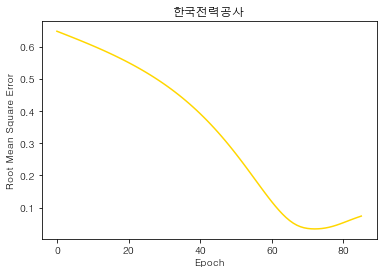
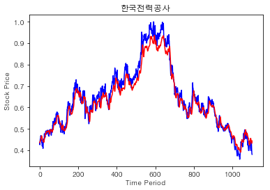
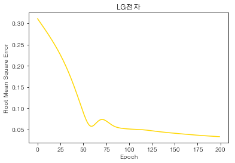
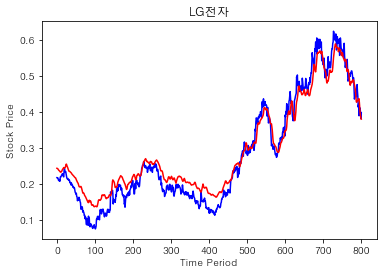
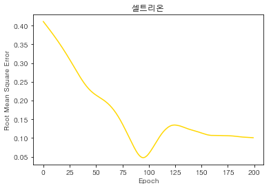
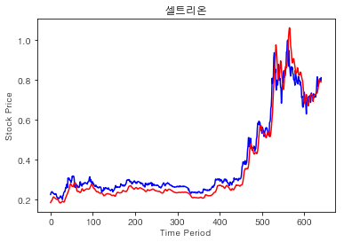
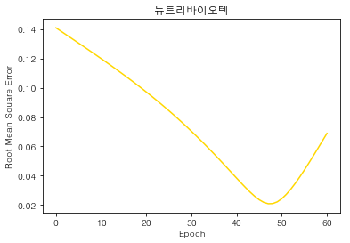

```python
comp_names = ["한국전력공사", "LG전자", "카카오", "셀트리온", "뉴트리바이오텍"]
for comp_name in comp_names :
    predict_next_close(comp_name)
```

    INFO:tensorflow:Restoring parameters from ./sessions/015760.ckpt
    








    RMSE: 0.033789802
    train_cnt: 72
    한달 모의투자 결과(100만원 투자): 950,094
    마지막 종가(2018.06.29): 32,000
    예측 종가: 35,011 (9.41%)
    
    INFO:tensorflow:Restoring parameters from ./sessions/066570.ckpt
    








    RMSE: 0.033152785
    train_cnt: 199
    한달 모의투자 결과(100만원 투자): 1,000,000
    마지막 종가(2018.06.29): 83,000
    예측 종가: 81,128 (-2.26%)
    
    INFO:tensorflow:Restoring parameters from ./sessions/035720.ckpt
    


    RMSE: 0.039973237
    train_cnt: 64
    한달 모의투자 결과(100만원 투자): 1,062,192
    마지막 종가(2018.06.29): 114,500
    예측 종가: 113,475 (-0.89%)
    
    INFO:tensorflow:Restoring parameters from ./sessions/068270.ckpt
    








    RMSE: 0.047551997
    train_cnt: 95
    한달 모의투자 결과(100만원 투자): 1,076,274
    마지막 종가(2018.06.29): 303,500
    예측 종가: 298,460 (-1.66%)
    
    

    C:\Users\south\Anaconda3\lib\site-packages\sklearn\utils\validation.py:475: DataConversionWarning: Data with input dtype int64 was converted to float64 by MinMaxScaler.
      warnings.warn(msg, DataConversionWarning)
    

    INFO:tensorflow:Restoring parameters from ./sessions/222040.ckpt
    





    RMSE: 0.020776311
    train_cnt: 47
    한달 모의투자 결과(100만원 투자): 862,156
    마지막 종가(2018.06.29): 21,150
    예측 종가: 26,886 (27.12%)
    
    
