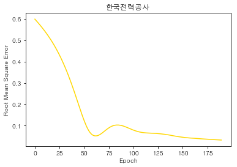
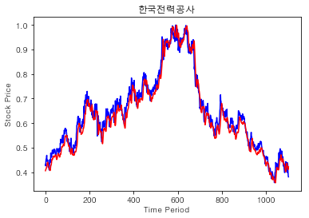
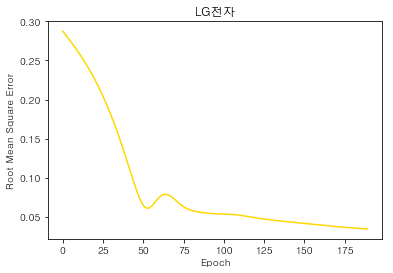
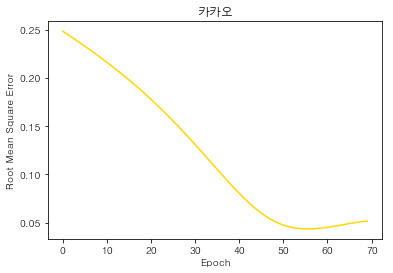
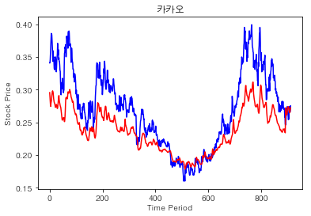
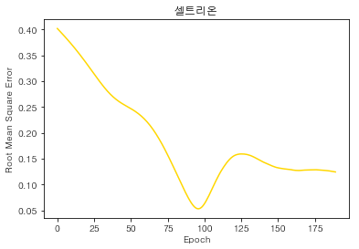
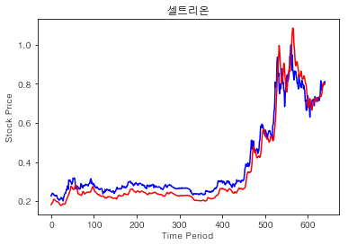
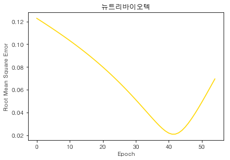
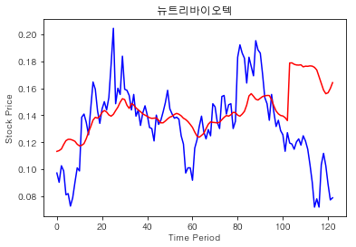

```python
comp_names = ["한국전력공사", "LG전자", "카카오", "셀트리온", "뉴트리바이오텍"]
```

    INFO:tensorflow:Restoring parameters from ./sessions/015760.ckpt
    








    RMSE: 0.0319275
    train_cnt: 199
    한달 모의투자 결과(100만원 투자): 958820.4224999998
    마지막 종가: 32,200
    예측 종가: 33,964 (5.48%)
    
    INFO:tensorflow:Restoring parameters from ./sessions/066570.ckpt
    





    RMSE: 0.034221124
    train_cnt: 199
    한달 모의투자 결과(100만원 투자): 1000000
    마지막 종가: 80,900
    예측 종가: 81,084 (0.23%)
    
    INFO:tensorflow:Restoring parameters from ./sessions/035720.ckpt
    








    RMSE: 0.043581173
    train_cnt: 66
    한달 모의투자 결과(100만원 투자): 1062191.575
    마지막 종가: 111,500
    예측 종가: 113,717 (1.99%)
    
    INFO:tensorflow:Restoring parameters from ./sessions/068270.ckpt
    








    RMSE: 0.053042777
    train_cnt: 106
    한달 모의투자 결과(100만원 투자): 1092776.4249999998
    마지막 종가: 298,000
    예측 종가: 297,045 (-0.32%)
    
    

    C:\Users\south\Anaconda3\lib\site-packages\sklearn\utils\validation.py:475: DataConversionWarning: Data with input dtype int64 was converted to float64 by MinMaxScaler.
      warnings.warn(msg, DataConversionWarning)
    

    INFO:tensorflow:Restoring parameters from ./sessions/222040.ckpt
    








    RMSE: 0.020919902
    train_cnt: 51
    한달 모의투자 결과(100만원 투자): 862155.8474999999
    마지막 종가: 21,050
    예측 종가: 26,856 (27.58%)
    
    
